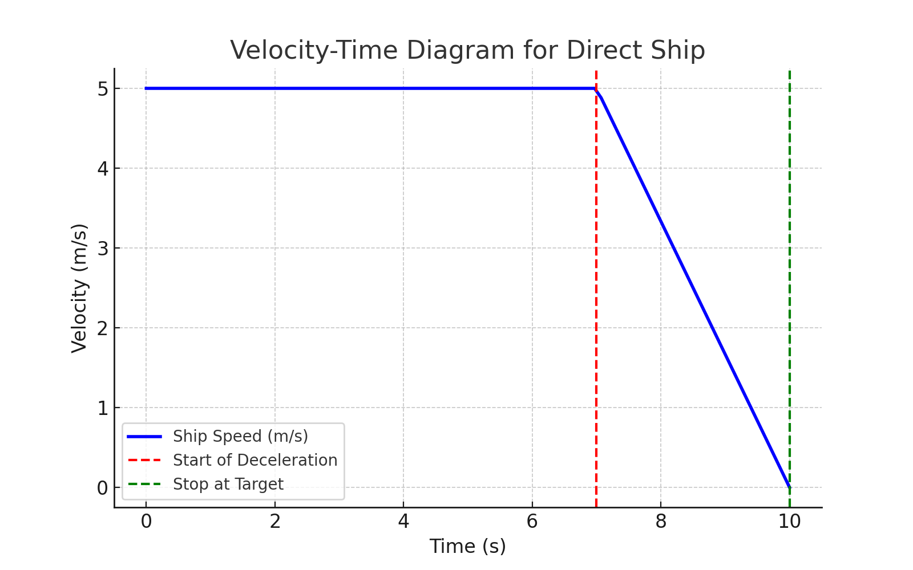

# FCC-A\* 航行路徑規劃器

## 概述

FCC-A\* 結合 **A\*** 搜索與 **GOODWIN** 船舶模型的模糊碰撞成本 (FCC)，為 **讓路船**（需避讓）規劃安全航線，並考慮 **直航船**（優先行駛）之預測路徑。

## 特色

- **FCC-A\*** 搜索，考慮碰撞風險。
- **模糊碰撞成本 (FCC)**，融合距離與角度計算風險。
- **直航船恆速，接近目標時減速停靠**。
- **可視化顯示** 航線與碰撞成本變化。

## 使用方式

### 1. 匯入 `fcc_a` 類別

```python
from FCC_A import fcc_a

planner = fcc_a(
    ship1_speed=2,
    ship1_pos=(50, 50),
    ship2_speed=5,
    ship2_pos=(0, 0),
    ship1_goal=(0, 0),
    ship2_goal=(50, 50),
    yield_ship=1,
    grid_scale=1
)

direct_path, yield_path = planner.calculate_path()
```

## 直航船速度-時間圖（V-T）

直航船維持 **恆速**，但在接近目標時 **線性減速** 停止：



## `calculate_path()` 方法輸出

- `direct_path`：直航船預測路徑 (x, y) (m)。
- `yield_path`：讓路船計劃路徑 (x, y) (m)。
- `planner.analysis`：包含步數、航向、FCC 風險值。

## 腳本模式（測試功能）

執行 `python FCC_A.py`，可視化：

- **Pygame 顯示船舶航線與步數標示**
- **Matplotlib 圖表「FCC vs. 步數」與「航向 vs. 步數」**

📌 **範例執行畫面：**  
（請手動截圖測試畫面，並放置於此處，例如 `test_run.png`）  


## 參數調整

可調整的參數：

- **GOODWIN 模型**：
  - `SECTER_RADIUS_LEFT`、`SECTER_RADIUS_RIGHT`、`SECTER_RADIUS_BACK`
- **FCC 權重**：`fcc_scale` 控制風險影響力。
- **航向計算**：`k_heading` 影響讓路船方向估算。

## 聯絡方式

📩 若有問題或建議，請聯繫 [wyattsheu@gmail.com]。
